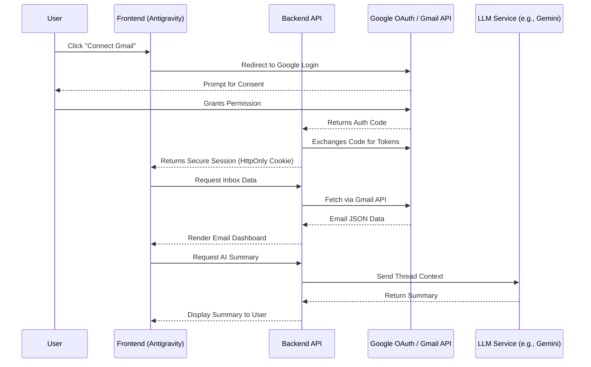

**AI-Powered Email Management Application**

## 1. Executive Summary
**Antigravity** is an intelligent, AI-driven email management application designed to supercharge user productivity. By securely connecting to email providers like Gmail via OAuth 2.0, the platform allows users to view, search, and organize their inbox while leveraging Large Language Models (LLMs) to summarize long threads, extract actionable insights, and draft context-aware replies.

## 2. System Architecture & Workflow

### 2.1 Core User Workflow
1. **Onboarding:** User navigates to the app and clicks "Connect Gmail".
2. **Authentication:** User is redirected to Google's secure OAuth consent screen.
3. **Authorization:** App securely receives an Access/Refresh Token (No passwords ever touched).
4. **Synchronization:** Backend fetches recent emails via Gmail API and populates the unified dashboard.
5. **AI Interaction:** 
   - User opens a long email thread.
   - User clicks **"Summarize"** → AI processes the thread and outputs a concise bulleted summary.
   - User clicks **"Draft Reply"** (optionally selecting a tone) → AI generates a response.
   - User reviews, edits, and clicks **"Send"**.

### 2.2 OAuth & Data Flow Diagram

## 3. Core Features (Must-Have MVP)

### 3.1 Authentication & Security
- **OAuth 2.0 Integration:** Secure connection to Gmail (and eventually other providers).
- **Zero-Password Policy:** Application will strictly rely on OAuth tokens; users will never be asked for their email passwords.
- **Credential Management:** Secure storage of API keys, client secrets, and tokens on the backend using encrypted environment variables. No sensitive credentials exposed to the frontend.

### 3.2 Inbox Management Dashboard
- **Unified Interface:** Clean, responsive UI to view and read emails.
- **Thread Support:** Group related emails into conversational threads.
- **Basic Actions:** Mark as Read/Unread, Star/Unstar, Archive, Delete, and Label assignment.
- **Robust Search:** Query emails based on sender, subject, keywords, or date ranges.
- **Composition & Sending:** Fully functional rich-text editor for composing and sending outgoing emails.

### 3.3 AI-Powered Features
- **Smart Summarization:** One-click summarization of lengthy emails or complex threads.
- **Contextual Reply Generation:** AI drafts replies based on the context of the received email.
- **Human-in-the-Loop Editing:** Mandatory review step allowing users to modify AI-generated drafts before dispatching.

## 4. Enhanced / Bonus Features (Phase 2 Roadmap)

To elevate *Antigravity* from a basic email client to a comprehensive productivity suite, the following features are planned:

### 4.1 Advanced AI Intelligence
- **Tone & Style Selection:** Draft replies with configurable tones (Professional, Friendly, Formal, Concise).
- **Grammar & Rewriting:** AI-assisted grammar correction and email polishing.
- **"Explain This Email":** Break down complex, technical, or legally dense emails into simple terms.
- **Smart Categorization & Priority:** Automatic detection of Important, Spam, or Phishing emails using AI classification.
- **Generative Subject Lines:** AI suggests high-open-rate subject lines based on email body content.

### 4.2 Productivity Extraction
- **Action Item Extraction:** Automatically detect and list tasks or to-dos embedded within emails.
- **Deadline & Date Parsing:** Extract dates and seamlessly offer Calendar integration.
- **Daily Digest:** A generated daily briefing summarizing inbox activity and high-priority messages.

### 4.3 Advanced Management & Integrations
- **Multi-Account Support:** Unify multiple Gmail or Outlook accounts into a single dashboard.
- **Bulk AI Management:** Select multiple emails and apply batch actions (e.g., "Summarize all selected updates").
- **Smart Search (Semantic):** Search by intent rather than exact keyword match (e.g., "Find the invoice from last month's software purchase").
- **Voice-to-Email:** Dictate thoughts and let AI structure them into a formal email.
- **Email Analytics:** Insights into response times, email volumes, and communication habits.

## 5. Technical Guidelines & Best Practices

1. **Security First:**
   - Use `HttpOnly` cookies for session management.
   - Do not commit `.env` files. Use secret managers in production.
   - Request only the minimum necessary OAuth scopes (`https://www.googleapis.com/auth/gmail.modify` or similar).
2. **Backend API:** Build RESTful or GraphQL endpoints to decouple the client from direct third-party API limits and handle token refreshes gracefully.
3. **Rate Limiting:** Implement rate limiting on AI endpoints to prevent abuse and manage API costs.
4. **Deployment:** Ensure CI/CD pipelines are configured with strict environment variable injection (e.g., Vercel, Render, AWS).